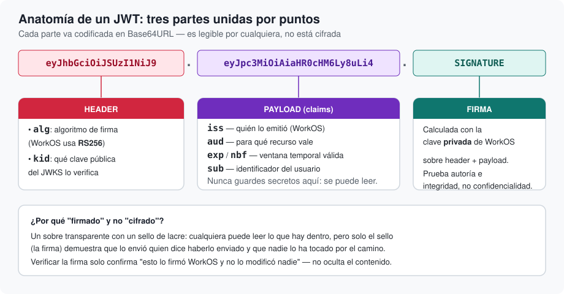

# Anatomía de un JWT

Qué es exactamente el token que viaja en la cabecera `Authorization: Bearer …`, y por qué firmar
no es lo mismo que cifrar.

## Descripción general

JWT son las siglas de *JSON Web Token* (RFC 7519). Es, en esencia, un poco de información sobre
quién eres y hasta cuándo vale, empaquetada de una forma que cualquiera puede leer pero que solo
su emisor —en este caso, WorkOS— puede haber producido de forma legítima.

Un JWT es una única cadena de texto con tres partes separadas por puntos:

```
eyJhbGciOiJSUzI1NiJ9.eyJpc3MiOiAiaHR0cHM6Ly8uLi4.SIGNATURE
└──────── header ────────┘└──────── payload ────────┘└─ firma ─┘
```



Cada una de las dos primeras partes es un objeto JSON codificado en Base64URL — no cifrado, solo
codificado, lo mismo que abrir un fichero `.zip` sin contraseña: cualquiera con el token en la
mano puede decodificarlo y leer su contenido tal cual con una herramienta como
[jwt.io](https://jwt.io). Esto es intencionado y muy importante tenerlo en cuenta: **un JWT no
es un secreto en sí mismo**, es una afirmación firmada. Nunca debe guardarse información
sensible (contraseñas, números de tarjeta) dentro de su contenido, porque cualquiera que
intercepte el token puede leerlo sin esfuerzo.

## El *header*: cómo se firmó

El header declara, sobre todo, dos cosas:

- **`alg`**: el algoritmo usado para firmar. WorkOS AuthKit firma sus tokens de acceso con
  **RS256** — un algoritmo de firma asimétrica (ver <doc:03-JWKSyRotacionDeClaves>).
  `BearerTokenVerifier` comprueba este valor contra una lista de algoritmos permitidos *antes*
  de comprobar la firma en sí — un token que declare un algoritmo inesperado se rechaza sin
  llegar siquiera a intentarlo.
- **`kid`** (*key ID*): qué clave, de entre las que WorkOS tiene publicadas, firmó este token en
  concreto. Es necesario porque WorkOS puede tener más de una clave activa a la vez durante una
  rotación — el siguiente artículo explica por qué.

## El *payload*: las *claims*

El payload contiene las **claims** (afirmaciones) sobre el token y su titular. `WorkOSClaims`,
el tipo público de esta librería que representa estas claims, decodifica las siguientes:

| Claim | Significado | ¿Quién la comprueba? |
|---|---|---|
| `iss` (*issuer*) | Quién emitió el token — la URL de tu proyecto de WorkOS AuthKit | `BearerTokenVerifier`, contra el issuer configurado |
| `aud` (*audience*) | Para qué recurso(s) es válido este token | `BearerTokenVerifier`, contra tus resource indicators |
| `exp` (*expiration*) | A partir de qué instante el token deja de ser válido | `WorkOSClaims.verify(using:)` |
| `nbf` (*not before*) | A partir de qué instante el token empieza a ser válido (opcional) | `WorkOSClaims.verify(using:)`, si está presente |
| `sub` (*subject*) | El identificador de la persona autenticada | Nadie lo valida — es el dato que tu aplicación consume, vía `request.authenticatedClaims?.sub` |

Fíjate en que `iss` y `aud` no se comprueban dentro del propio ``WorkOSClaims`` — se comprueban
en `BearerTokenVerifier`, porque los valores *esperados* (tu issuer concreto, tus resource
indicators concretos) son configuración de cada despliegue, no algo que un tipo de datos genérico
pueda conocer por sí mismo. `WorkOSClaims` solo sabe comprobar su propia validez temporal
(`exp`/`nbf`), que no depende de ninguna configuración externa.

## La firma: por qué "firmado" no es "cifrado"

Aquí está la pieza que de verdad aporta seguridad. Piensa en un sobre transparente cerrado con
un sello de lacre: cualquiera puede leer la carta que hay dentro con solo mirar a través del
cristal, pero solo el sello demuestra dos cosas a la vez —que lo envió quien dice haberlo
enviado, y que nadie ha abierto el sobre para cambiar la carta por el camino—. Eso es
exactamente lo que hace la firma de un JWT:

- **No oculta nada.** El header y el payload siguen siendo perfectamente legibles.
- **Prueba autoría.** Solo quien posee la clave privada correspondiente (WorkOS, y nadie más)
  puede haber generado una firma que sea válida para ese header+payload concretos.
- **Prueba integridad.** Si se cambia un solo carácter del header o del payload después de
  firmarlo —por ejemplo, para intentar colarse como otro usuario cambiando `sub`—, la firma deja
  de coincidir y la verificación falla.

Verificar la firma responde exactamente a una pregunta: *"¿firmó esto WorkOS, tal cual está,
sin que nadie lo tocara después?"*. No responde a "¿es esto secreto?" — no lo es — y tampoco
sustituye a comprobar `iss`, `aud`, `exp` o `nbf`: una firma válida en un token caducado, o con
la audiencia equivocada, sigue siendo un token que hay que rechazar. `BearerTokenVerifier`
(<doc:05-ArquitecturaGeneral>) hace todas esas comprobaciones juntas, en orden, antes de dar un
token por bueno.

## Siguiente paso

Para verificar una firma hace falta la clave pública correspondiente. De dónde sale esa clave,
por qué puede haber varias a la vez y qué pasa cuando WorkOS las renueva es el tema de
<doc:03-JWKSyRotacionDeClaves>.
