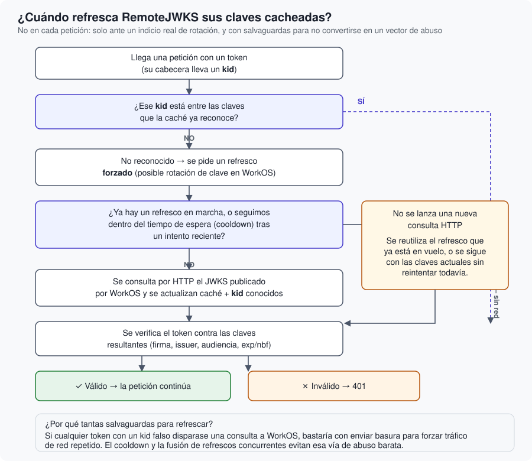

# JWKS y la rotación de claves

Cómo consigue esta librería la clave pública de WorkOS, por qué se cachea, y qué salvaguardas
evitan que ese mecanismo se convierta en un blanco fácil de abuso.

## Descripción general

WorkOS firma cada token con una **clave privada** que nunca sale de sus servidores. Para que
cualquiera pueda verificar esa firma sin necesidad de confiar ciegamente en WorkOS en cada
petición, WorkOS también publica la **clave pública** correspondiente en una URL conocida.

La analogía útil aquí es un notario: reconoces un sello notarial genuino porque conoces el
patrón del sello registrado del notario —información pública—, pero solo el notario tiene el
sello físico —privado— con el que estampar uno nuevo válido. Cualquiera puede *comprobar* un
sello; nadie salvo el notario puede *producir* uno auténtico. Con la criptografía de clave
pública/privada (la que usa RS256) pasa exactamente lo mismo: la clave pública sirve para
comprobar, la privada para firmar, y tener una no te permite deducir la otra.

## Qué es un JWKS

**JWKS** son las siglas de *JSON Web Key Set*: un documento JSON que publica una o varias claves
públicas, cada una con su propio identificador (`kid`, *key ID*). WorkOS AuthKit publica el suyo
en `<tu-issuer>/oauth2/jwks`. Es información pública por diseño — no hay nada que proteger en
ese documento, es literalmente la mitad de la clave que WorkOS quiere que todo el mundo tenga.

¿Por qué puede haber *varias* claves publicadas a la vez, si solo se está usando una para firmar
tokens nuevos? Porque WorkOS **rota** sus claves de firma periódicamente, como buena práctica de
higiene de seguridad (o como respuesta a un incidente). Durante la transición, la clave antigua
sigue publicada un tiempo para que los tokens ya emitidos con ella —que pueden seguir siendo
válidos durante minutos u horas más— se puedan seguir verificando, mientras los tokens nuevos ya
se firman con la clave nueva. El campo `kid` del header de cada token (ver
<doc:02-AnatomiaDeUnJWT>) le dice al verificador *cuál* de esas claves usar, sin tener que
probarlas todas por descarte.

## Cómo lo usa esta librería

`RemoteJWKS` (un `actor`, internamente) es quien se encarga de esto: descarga el documento JWKS
por HTTP y lo mantiene en memoria como una `JWTKeyCollection` lista para verificar tokens. El
protocolo `JWKSSource` es la interfaz que `BearerAuthMiddleware` usa para hablar con él —
gracias a esa capa, los tests de esta librería pueden sustituir `RemoteJWKS` por una colección
de claves local, sin red ni credenciales reales, y seguir ejercitando la misma lógica de
autenticación.

Pedir estas claves por red en **cada** petición sería a la vez lento (una ida y vuelta HTTP
extra en el camino crítico de cada request) e innecesariamente agresivo con WorkOS (miles de
peticiones idénticas por segundo, en el peor de los casos). Por eso se cachean, con dos
mecanismos de refresco:

1. **Refresco por caducidad**: pasado un intervalo (una hora, por defecto), la próxima petición
   dispara una actualización en segundo plano antes de verificar.
2. **Refresco por `kid` desconocido**: si el token que llega trae un `kid` que la caché actual no
   reconoce, es un indicio razonable de que WorkOS ha rotado su clave desde la última descarga —
   y eso sí justifica ir a buscarla de inmediato, sin esperar al ciclo normal.

## Por qué no refrescar ante *cualquier* fallo

Aquí hay una decisión de diseño que merece explicarse, porque a primera vista parecería más
simple hacer lo contrario. Sería tentador refrescar el JWKS cada vez que un token falla la
verificación, "por si acaso la clave cambió" — pero eso abre una vía de abuso barata: cualquiera
podría enviar tokens completamente inventados, uno detrás de otro, y forzar a tu servidor a
lanzar una petición de red a WorkOS por cada uno. Es un ataque de denegación de servicio de bajo
coste, tanto contra WorkOS como contra la propia red de salida de tu servidor.

Por eso el refresco forzado se dispara **solo** cuando el `kid` del token es uno que la caché no
conoce — la única situación que plausiblemente corresponde a una rotación real — y nunca por un
fallo de firma, de issuer, de audiencia o de caducidad, que no tienen nada que ver con qué claves
hay publicadas ahora mismo.

Dos salvaguardas adicionales completan el cuadro:

- **Fusión de refrescos concurrentes**: si diez peticiones llegan a la vez con un `kid`
  desconocido, no se lanzan diez descargas del JWKS — todas esperan al resultado de una única
  descarga en curso.
- **Tiempo de espera (*cooldown*)** tras un intento reciente: aunque lleguen más tokens con
  `kid`s desconocidos justo después, no se vuelve a intentar un refresco hasta que pase ese
  margen — así una ráfaga de tokens basura no se traduce en una ráfaga de peticiones a WorkOS.

## Un límite defensivo más

`RemoteJWKS` también rechaza cualquier respuesta del endpoint JWKS que supere 1&nbsp;MiB. El
JWKS real de WorkOS es diminuto (unas pocas claves, unos pocos kilobytes) — cualquier respuesta
que se acerque a ese tamaño es señal de que algo va mal (una URL mal configurada, una página de
error servida en lugar de JSON), y se descarta antes de intentar siquiera decodificarla.

## Siguiente paso

Ya sabes cómo se verifica *que un token es genuino*. Falta la otra mitad: cómo sabe un cliente a
qué WorkOS concreto dirigirse para conseguir uno, y qué papel juegan el issuer y la audiencia en
todo esto. Eso es <doc:04-OAuthYDescubrimientoRFC9728>.
