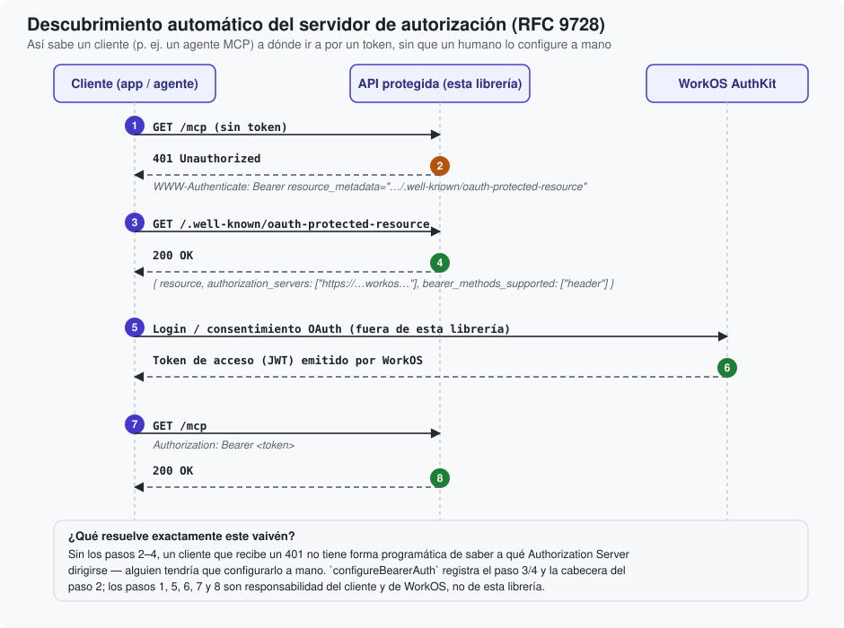

# OAuth, WorkOS y el descubrimiento (RFC 9728)

Qué papel juega cada parte en OAuth 2.0, qué significan de verdad "issuer" y "audiencia", y cómo
un cliente automatizado descubre a dónde ir a por un token sin intervención humana.

## Descripción general

OAuth 2.0 define varios roles que conviene distinguir antes de seguir:

- **Resource Owner** (propietario del recurso): la persona — tu usuario final.
- **Client** (cliente): la aplicación que quiere actuar en nombre de esa persona — puede ser una
  app web, una app móvil, o un agente/IA que habla el protocolo MCP.
- **Authorization Server** (servidor de autorización): quien verifica la identidad de la persona
  y emite los tokens. Aquí, ese papel lo cumple **WorkOS AuthKit**.
- **Resource Server** (servidor de recursos): la API que de verdad tiene los datos y que debe
  decidir si confía en un token dado. Aquí, ese papel lo cumple **tu aplicación**, con esta
  librería puesta delante.

`WorkOSBearerAuth` vive enteramente en el lado del *Resource Server*: nunca habla con el
*Resource Owner*, nunca gestiona un login, nunca emite un token. Solo comprueba, por cada
petición, si el token que trae el *Client* es uno que el *Authorization Server* (WorkOS) emitió
de verdad.

## Issuer y audiencia, sin jerga

Piensa en el **issuer** como el país que expide tu pasaporte, y en la **audiencia** (*resource
indicator*, en la terminología de WorkOS) como el país al que ese pasaporte te permite entrar.

- **Issuer (`iss`)**: la URL de tu proyecto concreto de WorkOS AuthKit. Un token con un issuer
  distinto al configurado se rechaza sin más — sería como presentar un pasaporte válido, pero
  expedido por un país distinto del que dice.
- **Audiencia (`aud`)**: para qué recurso, en concreto, es válido este token. Si tu organización
  tiene varias aplicaciones registradas en el mismo proyecto de WorkOS —por ejemplo, una API y
  un panel de administración—, un token válido para una **no** debe servir automáticamente para
  la otra, aunque ambas confíen en el mismo WorkOS. La audiencia es justo lo que evita esa
  confusión: es el equivalente a que tu pasaporte sirva para entrar en un país concreto, no en
  cualquier país que reconozca a la misma autoridad emisora.

`BearerTokenVerifier` comprueba ambas cosas de forma explícita e independiente. Puedes configurar
más de un resource indicator a la vez (por ejemplo, tu API de producción y tu entorno local) —
basta con que el token coincida con **uno** de ellos.

## El problema que resuelve el descubrimiento

Imagina un cliente automatizado —un agente que habla MCP, por ejemplo— que hace una petición a
tu API sin ningún token todavía, porque nunca ha hablado con ella antes. Recibe un 401. ¿Y ahora
qué? Sin más información, no tiene forma de saber *a qué WorkOS concreto* tiene que dirigirse
para conseguir un token válido — alguien tendría que habérselo configurado a mano de antemano,
lo cual no escala y rompe la promesa de "conéctate a cualquier servidor MCP compatible sin
configuración previa".

**RFC 9728** (*OAuth 2.0 Protected Resource Metadata*) resuelve exactamente esto: define un
documento JSON, publicado en una URL bien conocida
(`/.well-known/oauth-protected-resource`), que responde a la pregunta "¿en qué Authorization
Server confía este recurso?". Combinado con una cabecera `WWW-Authenticate` en la respuesta 401
que apunta a esa URL, un cliente puede seguir el rastro de forma completamente automática.



`configureBearerAuth` registra este endpoint por ti, con el contenido:

```json
{
  "resource": "https://api.tuproyecto.com/mcp",
  "authorization_servers": ["https://tu-proyecto.authkit.app"],
  "bearer_methods_supported": ["header"]
}
```

Y añade la cabecera correspondiente a cada 401 que emite `BearerAuthMiddleware`:

```
WWW-Authenticate: Bearer resource_metadata="https://api.tuproyecto.com/.well-known/oauth-protected-resource"
```

Nota lo que la librería **no** hace: no participa en los pasos 5 y 6 del diagrama (el propio
inicio de sesión y la emisión del token) — esos ocurren enteramente entre el cliente y WorkOS,
siguiendo el flujo OAuth que WorkOS documenta. El papel de esta librería empieza y termina en
"decir a quién preguntar" y "comprobar lo que traigan de vuelta".

## Por qué la ruta de descubrimiento se compara de forma exacta

Un detalle de seguridad que merece mención explícita: `BearerAuthMiddleware` compara la ruta de
descubrimiento con **igualdad exacta**, nunca con un prefijo. Si se comparase por prefijo, una
ruta como `/.well-known/oauth-protected-resource-evil` o
`/.well-known/oauth-protected-resource/mcp` (un subpath distinto del real) quedaría también sin
autenticar solo por *parecerse* a la ruta pública, ampliando sin querer la superficie de rutas
abiertas. El test `discoveryEndpointBypassIsExact` de esta librería existe específicamente para
evitar que esto se rompa sin que nadie se dé cuenta en un cambio futuro.

## Siguiente paso

Con estos cuatro conceptos —autenticación/autorización, anatomía de un JWT, JWKS y OAuth/RFC
9728— tienes ya todo el vocabulario que usan los artículos técnicos. El siguiente,
<doc:05-ArquitecturaGeneral>, entra en el código: qué tipo hace qué, y por qué está dividido así.
