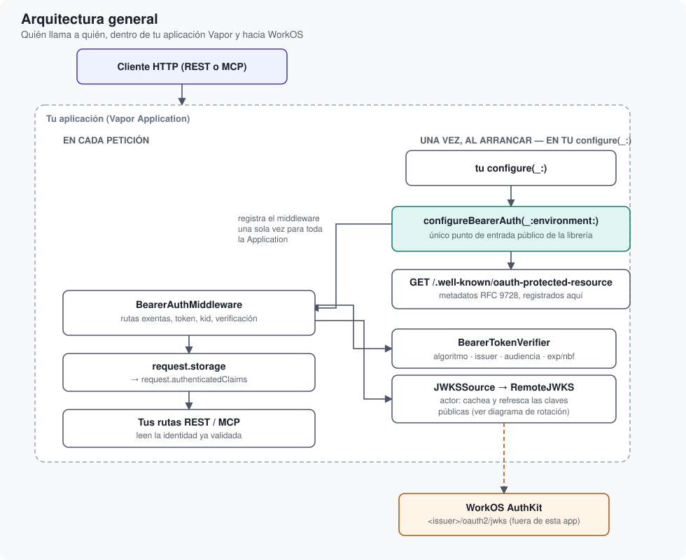

# Arquitectura general

Qué tipo hace qué, cómo encajan entre sí, y por qué la superficie pública es tan reducida.

## Descripción general

`WorkOSBearerAuth` se organiza en dos productos independientes:

- **`WorkOSBearerAuth`**: la librería en sí — el middleware, la verificación, la caché de
  claves. Depende de Vapor y JWTKit.
- **`WorkOSBearerAuthTesting`**: un módulo aparte, deliberadamente ligero (solo JWTKit +
  Foundation, sin Vapor), para firmar tokens de prueba en suites E2E — ver
  <doc:10-GuiaDeTesting>.

Se mantienen como dos productos, y no uno solo con dos partes, porque un proyecto que solo
necesita firmar un token de prueba no tiene ningún motivo para arrastrar Vapor y todo lo que
implica solo por eso.

## Las piezas, una por una

- **``configureBearerAuth(_:environment:)``** — el único punto de entrada público. Decide, según
  el entorno de Vapor y la configuración recibida, cuál de las <doc:07-LasCuatroConfiguraciones>
  aplica, y si corresponde, monta todo lo demás.
- **`BearerAuthMiddleware`** *(interno)* — el middleware real, atado una única vez a la
  `Application` completa. Por cada petición: decide si la ruta está exenta, extrae el token,
  decide si hace falta refrescar las claves, y delega la verificación propiamente dicha. El
  recorrido completo está en <doc:06-FlujoDeUnaPeticion>.
- **`BearerTokenVerifier`** *(interno)* — la política de la aplicación: qué algoritmos se
  aceptan, si se exige `kid`, y la comprobación de issuer/audiencia. Recibe la
  `JWTKeyCollection` ya resuelta como parámetro — no sabe nada de cómo se obtuvieron esas
  claves, lo que permite darle en los tests una colección construida a mano, sin red.
- **`JWKSSource`** *(protocolo interno)* / **`RemoteJWKS`** *(actor interno)* — de dónde salen
  las claves públicas de verdad. `RemoteJWKS` las descarga de WorkOS y las cachea; el protocolo
  existe para poder sustituirlo en tests. Ver <doc:03-JWKSyRotacionDeClaves>.
- **``WorkOSClaims``** *(público)* — la forma de las claims que le importan a esta aplicación.
  Es público porque es exactamente lo que `request.authenticatedClaims` devuelve; nada más en el
  módulo necesita construir uno.
- **``BearerAuthEnvironmentConfig``** *(público)* — los valores de entrada que necesita
  `configureBearerAuth`. Ver la sección siguiente para el porqué de este diseño.

## Por qué la superficie pública es tan pequeña

De toda esta lista, solo tres cosas son `public`: ``configureBearerAuth(_:environment:)``,
``BearerAuthEnvironmentConfig`` y ``WorkOSClaims`` (porque es el tipo de
`request.authenticatedClaims`). Todo lo demás —el middleware, el verifier, la caché de JWKS, los
errores internos— es intencionadamente invisible desde fuera del módulo.

Esto no es un descuido ni una limitación temporal: es la forma más simple de garantizar que
solo hay **una** manera correcta de usar esta librería. Si `BearerAuthMiddleware` fuera público,
alguien podría construir su propia instancia con una configuración distinta a la que arma
`configureBearerAuth`, y ahora habría dos caminos de autenticación posibles en la misma
aplicación — exactamente el problema que esta librería nace para eliminar (antes, REST no tenía
autenticación y `/mcp` tenía la suya propia). Una superficie pública mínima también significa
menos API que mantener estable entre versiones: cambiar cómo `RemoteJWKS` cachea sus claves por
dentro nunca es una ruptura de compatibilidad, porque nadie fuera de este módulo puede depender
de esos detalles.

## Dos decisiones de diseño que merecen explicarse

### `Request.storage`, no un valor task-local

Publicar la identidad autenticada en `request.storage` (el `authenticatedClaims` que esta
librería añade sobre `Request`) en vez de en un valor
[task-local](https://developer.apple.com/documentation/swift/tasklocal) de Swift fue una
decisión tomada tras comprobarlo empíricamente, no una preferencia de estilo. Un valor
task-local viaja implícitamente con la `Task` en la que se define — pero Vapor, en más de un
punto entre un middleware y la ruta a la que despacha, pasa de código `async` a
`EventLoopFuture` y de vuelta mediante un `Task { ... }` nuevo, y ese salto no conserva los
valores task-local que se hubieran fijado antes. Un valor guardado en `request.storage`, en
cambio, no depende de qué `Task` esté corriendo en cada momento: `Request` es un tipo por
referencia que atraviesa toda esa cadena, así que leerlo y escribirlo funciona sin importar
cuántas veces cambie de `Task` por el camino.

### Configuración como `struct`, no lecturas de entorno dentro de la librería

``BearerAuthEnvironmentConfig`` no lee ninguna variable de entorno por sí misma — solo
transporta los valores que le pasa la aplicación consumidora. Esto tiene dos consecuencias
deliberadas: primero, esta librería nunca queda atada a un nombre concreto de variable de
entorno (tu aplicación puede llamarlas como quiera, o incluso leerlas de un gestor de secretos
en vez de variables de entorno); segundo, la lógica de las <doc:07-LasCuatroConfiguraciones> se
puede comprobar en tests construyendo valores directamente, sin mutar variables de entorno reales
del proceso caso por caso.

## Siguiente paso

<doc:06-FlujoDeUnaPeticion> sigue el rastro de una petición HTTP, paso a paso, a través de todas
estas piezas.
