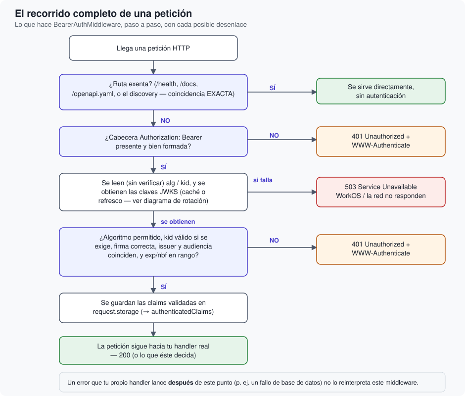

# El recorrido de una petición

Qué ocurre exactamente, paso a paso, desde que llega una petición HTTP hasta que sale una
respuesta — y por qué cada decisión está en el orden en que está.

## Descripción general

Todo esto ocurre dentro de `BearerAuthMiddleware.respond(to:chainingTo:)`, el único lugar donde
esta librería intercepta una petición. El diagrama resume las siete paradas posibles; el resto
de este artículo explica el porqué de cada una.

## 1. ¿Es una ruta exenta?

Antes de mirar siquiera si hay un token, se comprueba si la ruta pedida es una de las exentas:
`/health`, `/docs`, `/openapi.yaml`, o la ruta de descubrimiento RFC 9728 (comparada de forma
exacta — ver <doc:04-OAuthYDescubrimientoRFC9728>). Si lo es, la petición pasa directa al resto
de la aplicación. Esto existe porque hay tráfico legítimo que **no puede** traer un token: un
healthcheck de la plataforma no sabe de OAuth, y un cliente que aún no tiene token necesita poder
leer la propia documentación de cómo conseguir uno.

## 2. ¿Hay un token Bearer bien formado?

Se lee la cabecera `Authorization`. Si falta, o no tiene el formato `Bearer <token>`, la
petición se rechaza inmediatamente con 401 — sin llegar siquiera a mirar las claves JWKS. No
tiene sentido gastar ese paso si ni siquiera hay nada que verificar.

## 3. Lectura (sin verificar) de la cabecera del token

Antes de la verificación real, se decodifica —sin comprobar la firma todavía— la cabecera del
JWT para leer `alg` y `kid`. Esto **no** es una comprobación de seguridad en sí misma: es
simplemente leer un metadato para decidir el siguiente paso. La cabecera se analiza una única
vez y se reutiliza tanto aquí como en la verificación real de más abajo, para no analizarla dos
veces ni arriesgarse a que dos análisis independientes del mismo dato diverjan con el tiempo.

## 4. Obtención de las claves

Con el `kid` en la mano, se piden las claves actuales a `RemoteJWKS`. Si ese `kid` no es uno que
la caché reconozca, se fuerza un refresco antes de continuar — el detalle completo de cuándo
ocurre esto, y las salvaguardas que lo acompañan, está en
<doc:03-JWKSyRotacionDeClaves>.

Si este paso falla — WorkOS o la red no responden — la respuesta es **503**, no 401. Esta
distinción es intencionada y se explica con detalle en <doc:08-ManejoDeErrores>: en este punto el
token de quien hizo la petición **nunca ha llegado a evaluarse**, así que decirle "tu token no
vale" (401) sería sencillamente falso.

## 5. Verificación completa

Con las claves ya disponibles, `BearerTokenVerifier` comprueba, en este orden: que el algoritmo
declarado está permitido, que hay `kid` si se exige, que la firma es correcta, que el issuer
coincide, que la audiencia coincide, y que `exp`/`nbf` sitúan el momento actual dentro de la
ventana de validez del token. Cualquier fallo en cualquiera de estos puntos termina en 401 — y
siempre con la misma cabecera `WWW-Authenticate` que apunta al endpoint de descubrimiento (ver
<doc:04-OAuthYDescubrimientoRFC9728>), para que un cliente automatizado sepa qué hacer a
continuación.

## 6. Publicación de la identidad

Si todo lo anterior es correcto, las claims validadas se guardan en `request.storage` — de ahí
en adelante disponibles como `request.authenticatedClaims` para cualquier parte de tu aplicación
que la petición acabe alcanzando (ver <doc:05-ArquitecturaGeneral> para el porqué de usar
`storage` en vez de un valor task-local).

## 7. La petición continúa

Y aquí termina la responsabilidad de este middleware. Es importante notar qué pasa **después**
de este punto: si tu propio handler lanza un error —por ejemplo, un fallo de base de datos—, ese
error se propaga tal cual hacia el `ErrorMiddleware` de Vapor (normalmente, un 500). El
middleware de autenticación no reinterpreta ese fallo como un problema de token, porque no lo es:
el token ya se comprobó, y era correcto.

## Siguiente paso

Todo lo anterior describe **una** petición ya en marcha. Antes de eso, en el arranque de tu
aplicación, `configureBearerAuth` tiene que decidir si toda esta maquinaria se activa siquiera —
eso es <doc:07-LasCuatroConfiguraciones>.
