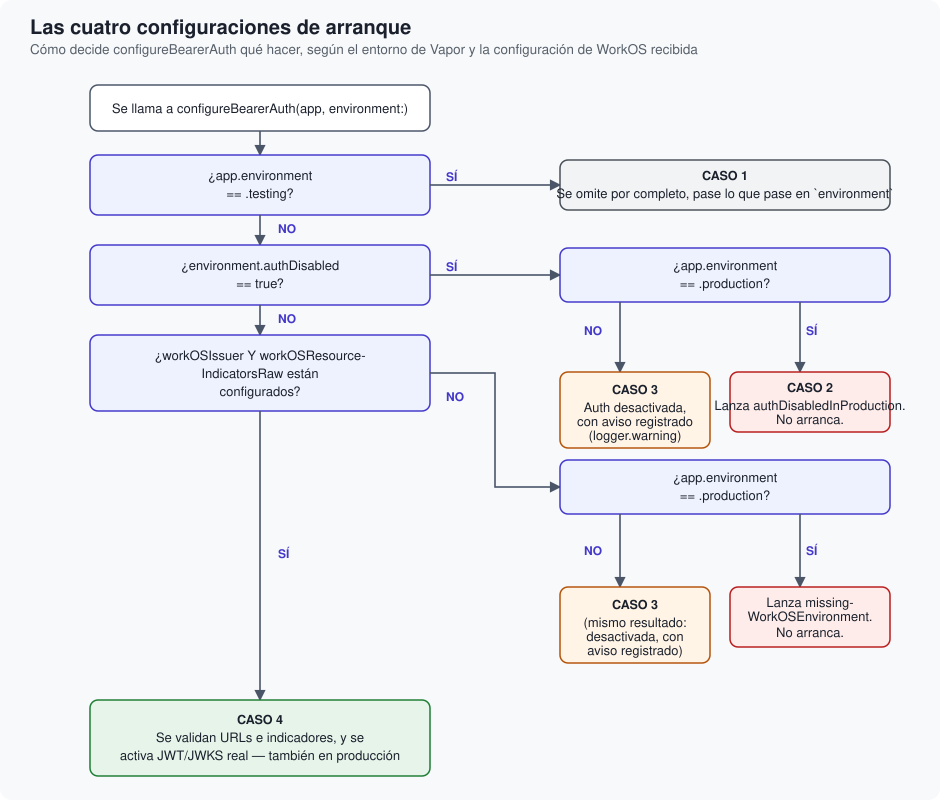

# Las cuatro configuraciones de arranque

Cómo decide ``configureBearerAuth(_:environment:)`` qué activar, y por qué cada una de las
cuatro ramas está resuelta como está.

## Descripción general

`configureBearerAuth` se llama una sola vez, dentro de tu `configure(_:)`. Su lógica se
bifurca en cuatro casos posibles, evaluados en este orden estricto — el orden importa, porque
cada comprobación asume que las anteriores ya se han descartado.

## Caso 1 — Entorno `.testing`

Si `app.environment == .testing`, la función retorna de inmediato, sin mirar siquiera el resto
de `environment`. No hay excepciones a esto.

**Por qué es incondicional**: el fichero `.env.local` de tu propia aplicación bien podría llevar
credenciales reales de un entorno de staging de WorkOS, pensadas para ejecutar `swift run` en
local. Si la condición para saltarse la autenticación dependiera solo de esas variables, `swift
test` podría acabar intentando una conexión real contra el JWKS de WorkOS sin que nadie lo
pretendiera — un test que a veces pasa y a veces falla según la conectividad de quien lo ejecuta.
Comprobar `app.environment` en su lugar hace que el comportamiento en tests sea determinista,
venga lo que venga en las variables de entorno.

Esto no dice que `BearerAuthMiddleware` se quede sin probar — la propia suite de esta librería lo
ejercita end-to-end (`BearerAuthMiddlewareTests`), montándolo a mano con una fuente de claves
local en lugar de la real.

## Caso 2 — Autenticación desactivada en producción

Si `environment.authDisabled == true` **y** `app.environment == .production`,
`configureBearerAuth` **lanza un error** y tu aplicación no llega a arrancar.

**Por qué falla en vez de simplemente avisar**: `authDisabled` es una vía de escape pensada
para desarrollo local y para entornos de test que no tienen a mano credenciales reales de
WorkOS. Una vía de escape así nunca debe poder llegar, ni por un despiste en la configuración de
un entorno, a un despliegue real de producción con datos reales. Fallar de forma ruidosa y
temprana —al arrancar, no cuando llegue la primera petición— es mucho mejor que dejar una API de
producción completamente abierta por una variable de entorno mal puesta.

## Caso 3 — Autenticación desactivada fuera de producción

Si `authDisabled` es `true` en cualquier entorno que no sea producción, **o** si ni `authDisabled`
ni la configuración de WorkOS (`workOSIssuer`/`workOSResourceIndicatorsRaw`) están presentes
fuera de producción, la autenticación queda desactivada.

**Por qué con un aviso, y no en silencio**: que todas las rutas queden accesibles sin token es
una decisión importante, y nunca debería descubrirse por accidente semanas después. Por eso
`configureBearerAuth` registra un `logger.warning` explícito cada vez que toma este camino — el
objetivo no es impedir el desarrollo sin WorkOS a mano, sino asegurarse de que nadie lo confunda
con autenticación real.

## Caso 4 — Configuración de WorkOS presente

Si `workOSIssuer` y `workOSResourceIndicatorsRaw` están ambos presentes, se activa la
verificación real — **incluida en producción**, donde de hecho es obligatoria: si esta rama no se
alcanza en producción (por configuración ausente), el caso 2 ya lo habría impedido antes.

Antes de activar nada, se valida con rigor:

- El issuer debe ser una URL absoluta `https://` con host — un issuer `http://`, o que no sea
  siquiera una URL, se rechaza. No es una suposición implícita de que HTTPS sea buena idea: es
  una comprobación explícita.
- `workOSResourceIndicatorsRaw` se divide por comas, se recorta cada valor, y se descartan los
  vacíos. Si no queda ninguno, es un error de configuración explícito, no una lista vacía
  silenciosa.
- Cada resource indicator resultante debe ser también una URL absoluta `https://` con host.
- El **primero** de la lista, en el orden en que se escribieron, se toma como el indicador
  primario — el que se usa para construir la URL del endpoint de descubrimiento. Se conserva el
  orden explícitamente (en vez de usar un `Set`, cuyo orden interno no está garantizado) para que
  el resultado sea el mismo cada vez que arranca la aplicación.

## Siguiente paso

Cuando algo de todo esto sale mal, o cuando una petición concreta se rechaza, el resultado es
siempre uno de un conjunto reducido y bien definido de errores — <doc:08-ManejoDeErrores> los
recoge todos, junto con qué código HTTP produce cada uno y por qué.
