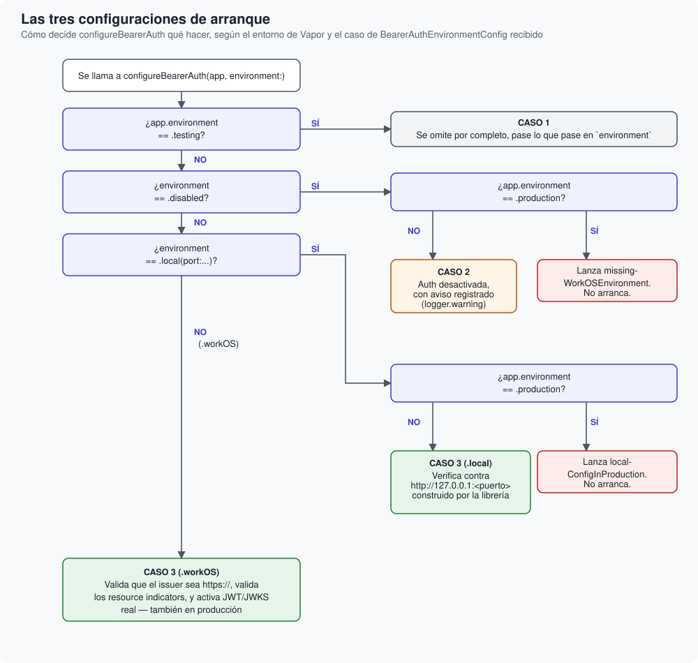

# Las tres configuraciones de arranque

Cómo decide ``configureBearerAuth(_:environment:)`` qué activar, y por qué cada una de las
tres ramas está resuelta como está.

## Descripción general

`configureBearerAuth` se llama una sola vez, dentro de tu `configure(_:)`. Su lógica se
bifurca en tres casos posibles, evaluados en este orden estricto — el orden importa, porque
cada comprobación asume que las anteriores ya se han descartado.

## Caso 1 — Entorno `.testing`

Si `app.environment == .testing`, la función retorna de inmediato, sin mirar siquiera el resto
de `environment`. No hay excepciones a esto.

**Por qué es incondicional**: el fichero `.env.local` de tu propia aplicación bien podría llevar
credenciales reales de un entorno de staging de WorkOS, pensadas para ejecutar `swift run` en
local. Si la condición para saltarse la autenticación dependiera solo de esas variables, `swift
test` podría acabar intentando una conexión real contra el JWKS de WorkOS sin que nadie lo
pretendiera — un test que a veces pasa y a veces falla según la conectividad de quien lo ejecuta.
Comprobar `app.environment` en su lugar hace que el comportamiento en tests sea determinista,
venga lo que venga en las variables de entorno.

Esto no dice que `BearerAuthMiddleware` se quede sin probar — la propia suite de esta librería lo
ejercita end-to-end (`BearerAuthMiddlewareTests`), montándolo a mano con una fuente de claves
local en lugar de la real.

## Caso 2 — `BearerAuthEnvironmentConfig.disabled`

- **En producción**, `configureBearerAuth` **lanza** `missingWorkOSEnvironment` y tu aplicación
  no llega a arrancar.
- **Fuera de producción**, la autenticación queda desactivada, con un `logger.warning` explícito.

**Por qué falla en producción en vez de simplemente avisar**: no hay ninguna vía de escape
explícita para desactivar la autenticación — si tu `configure.swift` construye `.disabled` en
un despliegue real, es casi con toda seguridad un error de configuración, nunca una decisión
deliberada. Fallar de forma ruidosa y temprana —al arrancar, no cuando llegue la primera
petición— es mucho mejor que dejar una API de producción completamente abierta.

**Por qué con un aviso fuera de producción, y no en silencio**: que todas las rutas queden
accesibles sin token es una decisión importante, y nunca debería descubrirse por accidente
semanas después. Por eso `configureBearerAuth` registra un `logger.warning` explícito cada vez
que toma este camino — el objetivo no es impedir el desarrollo sin WorkOS a mano, sino
asegurarse de que nadie lo confunda con autenticación real. Para probar el flujo de
autenticación real sin depender de credenciales de WorkOS, usa `.local` con un `AuthMock`
corriendo en la misma máquina (ver <doc:11-PreguntasFrecuentes>) en vez de `.disabled`.

## Caso 3 — `.workOS` o `.local`

Ambos casos activan la verificación real de JWT/JWKS — la diferencia es solo qué forma tiene el
issuer, y en qué entornos está permitido cada uno.

- **`.workOS(issuer:resourceIndicatorsRaw:)`** — el issuer debe ser una URL absoluta `https://`
  con host; se rechaza cualquier otra cosa, sin excepción. Permitido en **cualquier entorno**,
  incluida producción, donde de hecho es el único caso que `configureBearerAuth` acepta: si esta
  rama no se alcanza en producción (por configuración ausente), el caso 2 ya lo habría impedido
  antes.
- **`.local(port:resourceIndicatorsRaw:)`** — no recibe un issuer en crudo, solo un puerto:
  `configureBearerAuth` construye el issuer como `http://127.0.0.1:<puerto>` directamente, así
  que no hace falta analizar ni validar ninguna URL para confirmar que es loopback — el propio
  caso ya lo garantiza. Pensado para un `AuthMock` real corriendo en la misma máquina, para que
  la verificación de tokens se ejerza de verdad en vez de desactivar la autenticación sin más
  (ver <doc:11-PreguntasFrecuentes>). **Rechazado en `.production`** con `localConfigInProduction`
  — a diferencia del resto de restricciones de este caso, esta no depende de qué variables de
  entorno estén fijadas en un despliegue real: el propio `configureBearerAuth` se niega a
  aceptar `.local` ahí, pase lo que pase en la configuración.

En ambos casos, antes de activar nada se valida también `resourceIndicatorsRaw`, exactamente
igual:

- Se divide por comas, se recorta cada valor, y se descartan los vacíos. Si no queda ninguno, es
  un error de configuración explícito, no una lista vacía silenciosa.
- Cada resource indicator resultante debe ser una URL absoluta `https://` con host — sin
  excepción, ni siquiera bajo `.local`: a diferencia del issuer, un resource indicator nunca se
  dereferencia por red (ver ADR 0004 de `FinanceCore`), así que no hay ningún argumento de
  loopback que lo relaje.
- El **primero** de la lista, en el orden en que se escribieron, se toma como el indicador
  primario — el que se usa para construir la URL del endpoint de descubrimiento. Se conserva el
  orden explícitamente (en vez de usar un `Set`, cuyo orden interno no está garantizado) para que
  el resultado sea el mismo cada vez que arranca la aplicación.

## Siguiente paso

Cuando algo de todo esto sale mal, o cuando una petición concreta se rechaza, el resultado es
siempre uno de un conjunto reducido y bien definido de errores — <doc:08-ManejoDeErrores> los
recoge todos, junto con qué código HTTP produce cada uno y por qué.
