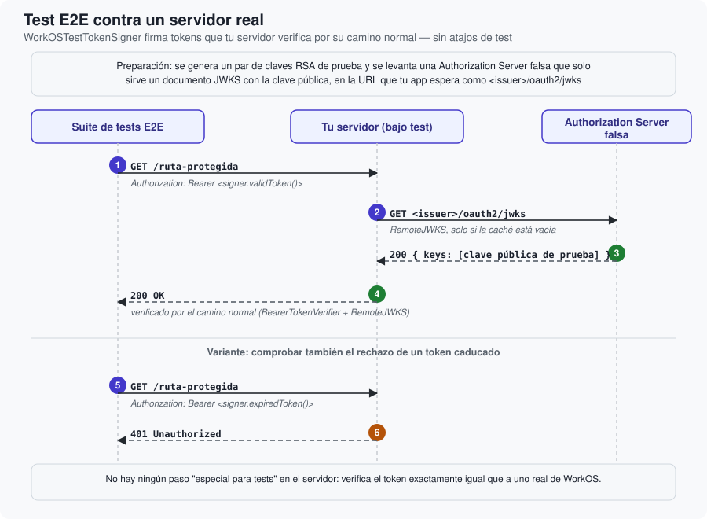

# Guía E2E

Cómo montar, paso a paso, una suite de tests end-to-end que autentica peticiones reales contra
un servidor que usa `WorkOSBearerAuth`, sin ninguna credencial real de WorkOS.

## Descripción general

El objetivo es que tu servidor bajo test verifique el token exactamente por su camino normal
—`BearerTokenVerifier` + `RemoteJWKS`, tal como lo haría con un token genuino de WorkOS— en
vez de introducir un atajo especial "solo para tests" que dejaría sin probar la ruta de
verificación real. Para conseguirlo hacen falta dos piezas que trabajan juntas: una clave RSA de
prueba, y una Authorization Server falsa que publique su mitad pública como si fuera el JWKS de
WorkOS.



## 1. Genera un par de claves RSA de prueba

Una clave dedicada exclusivamente a tests, sin relación alguna con ninguna credencial real:

```bash
openssl genrsa -out e2e-test-key.pem 2048
openssl rsa -in e2e-test-key.pem -pubout -out e2e-test-key.pub.pem
```

Guarda `e2e-test-key.pem` (la privada) como un secreto de tu pipeline de CI — nunca en el
repositorio.

## 2. Levanta una Authorization Server falsa

Solo necesita responder, en la ruta `<issuer-falso>/oauth2/jwks`, un documento JSON con la
clave **pública** codificada en el formato JWK, con el mismo `kid` que usarás al firmar. No hace
falta que sea una aplicación completa — un servidor HTTP mínimo (incluso un fichero estático
servido detrás de un proxy, en el caso más simple) es suficiente, siempre que la URL coincida con
lo que tu servidor bajo test espera como issuer.

## 3. Arranca el servidor bajo test apuntando a esa Authorization Server falsa

Configura `WORKOS_ISSUER` (o el nombre que le hayas dado en tu propia app — ver la guía de
implantación del catálogo de `WorkOSBearerAuth`) para que apunte a la URL de la Authorization
Server falsa, y `WORKOS_RESOURCE_INDICATORS` al recurso que vas a probar. El servidor arranca
exactamente como lo haría contra el WorkOS real — no sabe, ni le importa, que su JWKS viene de
una implementación falsa.

## 4. Firma un token con `WorkOSTestTokenSigner`

```swift
import WorkOSBearerAuthTesting

let signer = WorkOSTestTokenSigner(
    issuer: ProcessInfo.processInfo.environment["E2E_AUTH_TEST_ISSUER"] ?? "http://fake-authkit",
    resource: ProcessInfo.processInfo.environment["E2E_AUTH_TEST_RESOURCE"] ?? "http://localhost:8080",
    privateKeyPEM: ProcessInfo.processInfo.environment["E2E_AUTH_TEST_PRIVATE_KEY"]
)

let token = try await signer.validToken()
```

`issuer` y `resource` deben coincidir exactamente con lo que configuraste en el paso 3.
`privateKeyPEM` es el contenido del fichero privado del paso 1. Si tu pipeline no tiene esta
infraestructura montada, pasa `nil` — `validToken()`/`expiredToken()` devuelven `nil` en lugar
de lanzar un error, para que la propia suite pueda decidir saltarse estas comprobaciones en vez
de fallar por completo.

## 5. Haz la petición real y comprueba la respuesta

```swift
var request = URLRequest(url: URL(string: "https://tu-servidor-bajo-test/mcp")!)
if let token {
    request.setValue("Bearer \(token)", forHTTPHeaderField: "Authorization")
}
let (_, response) = try await URLSession.shared.data(for: request)
```

## 6. Repite con `expiredToken()`

```swift
let expired = try await signer.expiredToken()
```

Un token firmado correctamente pero con `exp` ya en el pasado — útil para comprobar, contra el
servidor real, que el camino de rechazo también funciona de extremo a extremo, no solo el de
aceptación.

## Por qué merece la pena este montaje, en vez de un atajo más simple

Podría parecer más sencillo añadir a la propia aplicación bajo test una variable de entorno tipo
`SKIP_AUTH_FOR_TESTS`. El problema es que, en cuanto existe ese atajo, la suite E2E deja de
probar la parte que más importa: si un token genuino de WorkOS, con toda su cadena de
verificación real, es aceptado o rechazado correctamente. Con la Authorization Server falsa, el
único elemento "de mentira" es el emisor de las claves — todo lo demás, desde
`Authorization: Bearer …` hasta la comprobación de firma, issuer, audiencia y caducidad, es
exactamente el código que correrá en producción.

## Siguiente paso

Para el resto de escenarios de test —los que no necesitan un servidor real por la red—, consulta
la guía de testing en el catálogo de `WorkOSBearerAuth`.
